# Skin-Cancer-Classifier-Dermatologist-AI
Use CNN model to visually diagnose between 3 types of skin lesions using dermoscopic images.

This "Dermatologist-ai" project is part of the [Deep Learning Nanodegree with Udacity](https://www.udacity.com/course/deep-learning-nanodegree--nd101). The skin cancer classification model was trained and tested using both own GPU and google colab.

## Description
This project can visually diagnose between 3 types of skin lesions: melanoma, the deadliest form of skin cancer, and two types of benign lesions, nevi and seborrheic keratoses. 86% overall performance achieved on unseen test set. 

The data and objective are pulled from the [2017 ISIC Challenge on Skin Lesion Analysis Towards Melanoma Detection](https://challenge.kitware.com/#challenge/583f126bcad3a51cc66c8d9a). As part of the challenge, participants were tasked to design an algorithm to diagnose skin lesion images as one of three different skin diseases (melanoma, nevus, or seborrheic keratosis).

## Content
- Mount Google Drive
- Select folder with notebook and data folder in google colab
- Download the datasets and unzip into data folder
- import librairies and count available samples
- explore the data
- calculate corrective weights to compensate for skewness
- Set Dataloader
- Define train, validate and test functions
- Train the models
    - Obtain pre-trained VGG16 and adjust classifier section
    - specify loss function and optimizer
    - train and test the model
   - Repeat with Inception V3 and ResNet-152
 - Get predictions and prepare results file
 - Evaluate predictions and plot scores, ROC and confusion matrix

## Getting started
1.	Clone the repository and create a `data/` folder to hold the dataset of skin images.
2.	Create folders to hold the training, validation, and test images.
3.	Download and unzip the [training data](https://s3-us-west-1.amazonaws.com/udacity-dlnfd/datasets/skin-cancer/train.zip) (5.3 GB).
4.	Download and unzip the [validation data](https://s3-us-west-1.amazonaws.com/udacity-dlnfd/datasets/skin-cancer/valid.zip) (824.5 MB).
5.	Download and unzip the [test data](https://s3-us-west-1.amazonaws.com/udacity-dlnfd/datasets/skin-cancer/test.zip) (5.1 GB).
6.	Place the training, validation, and test images in the ` data/` folder, at `data/train/`, `data/valid/`, and `data/test/`, respectively. Each folder should contain three sub-folders (`melanoma/`, `nevus/`, `seborrheic_keratosis/`), each containing representative images from one of the three image classes.

## Approach
I started off with 4 pre-trained models (VGG16, Inception-V3, ResNet152, ResNet50) to benefit from transfer learning. These models have been already heavily trained for classification tasks using ImageNet database. ImageNet is a dataset of over 15 millions labeled high-resolution images with around 22,000 categories. To train these models, ILSVRC uses a subset of ImageNet of around 1000 images in each of 1000 categories. In all, there are roughly 1.2 million training images, 50,000 validation images and 100,000 testing images.

I adjusted the classification end of these networks to the task at hand (classification between 3 labels only).  I used the training and validation data to train a model that can distinguish between the three different image classes, saving the best parameters based on the reduction of the loss on the validation data.
Then, the test images are used to gauge the performance of the model on previously unseen images.

## Dataset
The proposed training, validation and test sets contain 2000, 160, 600 high-res RGB images respectively. The distribution between classes in the train set is heterogeneous. Nevus is highly over-represented (4x to 5x more images than the other two classes). I therefore used [ISIC database](https://www.isic-archive.com/#!/topWithHeader/onlyHeaderTop/gallery?filter=%5B%5D) to augment the number of under represented classes. I added about 1,160 new training images which i could find for Melanoma and seborrheic keratosis. To compensate for under-representation of seborrheic keratosis, I increased the number of images by applying horizontal and vertical flip, allowing to triple the amount in this class. Finally I removed all training images polluted by yellow / black markers, rulers (visual references added when taking the picture), pen annotations (circles around or arrows pointing to the lesion) which were visible on the image.

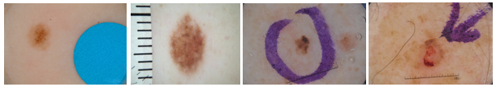

The training dataset has the following final composition:

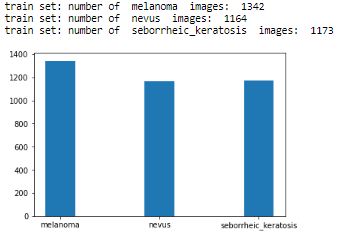

It is also possible to compensate class imbalance in the training set by calculating weights to provide to the loss function during training. I did not use this option in the final runs.

During training, I used various augmentation techniques for the training set to expand beyond the circa 3,700 images now available. In addition, available images came with multiple resolutions (for example (2592, 1936, 3)). The pre-trained models must have input images with minimum resolution of 299x299 (for Inception) or 224x224 (other models). In order to preserve details as much as possible (downsampling of images is at the expense of pixels), I determined the smallest dimensions available in the dataset, ie 450 x 576, and decided to resize images to that maximum possible uniform size. However I did not see any material difference vs using standard input size while this obviously increases memory and computation requierements and necessitate to reduce the batch_size to avoid memory crash.

## Model architecture
I first started by training only the modified classification section of the networks without much success (2 or 3 fully connected layers, freezing pretrained networks). VGG model did not deliver good performance (below 55% accuracy after 10 epochs). ResNet152 neither. Inception V3 reached 65% overall accuracy after 10 epochs. Note that random guess over the 3 classes is 33%. This could be explained by the fact that the dermoscopic images are really different from the ImageNet datasets.
So ultimately I tried training the whole network initialized with the pretrained weigths right from the beginning (all layers set to train). This proved the right approach:
- ResNet50 achieved over 70% accuracy after 15 epochs so I focused on this model to improve that basepoint up to 84% (see results section below).
- Finally I re-ran this experiment with Inception V3 pre-trained, using a simple classifier end: FC layer (2048,1024)>Relu>DropOut(0.1)>FC layer (1024,3)...and reached 86% accuracy after 15 epochs (7.5 hours training on google colab with Tesla K80 GPU). Note that I used the full training set of images on Google Colab, ie not removing the images with markers, rulers, ink annotations...ending up with a bigger train set of just over 4,000 images (1406 Melanoma, 1372 Nevus, 1257 keratosis). So the Inception performance is even more robust in terms of generalization.

*Highlights ResNet architecture:*
ResNet was designed by Microsoft teams in 2015 to provide a class of network efficient despite being very deep. ResNet152 version is the deepest amongst ResNet family. ResNet stands for "residual network". The main novalty is the introduction of shortcut connections using a technique called "residual mapping" to fight against deep network's performance degradation.

While it is generally accepted that deeper networks are capable of learning more complex functions, practitioners faced the problem that adding more layers had a negative effect on the final performance, ie deeper networks often converge at a higher error rate than their shallower counterparts. Simply stacking more layers degrades the model's performance.

ResNet proposed a remedy to this degradation problem by introducing residual blocks in which intermediate layers of a block learn a residual function with reference to the block input. You can think of this residual function as a refinement step in which we learn how to adjust the input feature map for higher quality features. This compares with a "plain" network in which each layer is expected to learn new and distinct feature maps. In the event that no refinement is needed, the intermediate layers can learn to gradually adjust their weights toward zero such that the residual block represents an identity function.

In other words, a deep convolutional network will usually learn low/mid/high level features at the end of its stacked layers. In residual mapping, instead of trying to learn some features, the layer learns some residual which is the subtraction of feature learned from the input of that layer. ResNet does this using shortcut connections (directly connecting input of n-th layer to some (n+x)th layer). Training this form of networks is easier than training simple deep convolutional neural networks and it was proven to resolve the problem of degrading accuracy as the network gets very deep. Residual mapping introduces shortcut connections using identity F(x)+x where F(x) is the residual let to be learned by the conv layers/blocks (see illustration below). For more information, refer to the founding [paper](https://arxiv.org/abs/1512.03385).

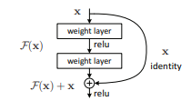                     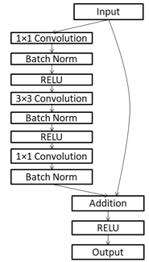  

ResNet class produces results that are better than standard networks, ie achieves higher accuracy, when the depth of the network increases. The table below shows the layers and parameters in the different ResNet architectures. ResNet152 has over 58 Mio parameters, twice as much as Inception-V3.

 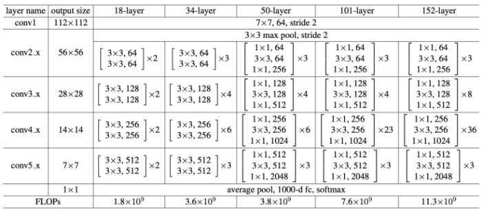
 
 Overview of ResNet152 with residual connections.

With 50 layers, ResNet50 is just below 26 Mio parameters. I used a modified version, adjusting the classifier down to 3 classes (using 2 fully-connected layers with drop out and ELU activation). This led to 25.6 Mio parameters in total.

- Training:
I started off with a pretrained version of ResNet50 allowing all layers to be fined-tuned while training the new classifier end. After 15 epochs (Adam optimizer, lr of 10-4, batch of 10 images 224x224) the network achieved 73% overall accuracy on the test set (unseen images). I trained for another 20 epochs with a reduced learning rate of 10-5. And a further 5 epochs @ 10-6. The test accuracy improved to 84% with good performance accross the three classes (see accuracies below). Additional training could certainly allow to improve even further.

          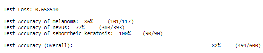 

*Highlights Inception V3 architecture* (inspired from this [paper](https://medium.com/@sh.tsang/review-inception-v3-1st-runner-up-image-classification-in-ilsvrc-2015-17915421f77c)).
Inception V3 is an improvement over previous versions of this architecture (also called GoogleNet). The V3 objective was to reduce the number of parameters so that the model is less computational intensive, less prone to overfitting and allows to go really deep. This was proposed in the following [paper](https://arxiv.org/abs/1512.00567) published by V3's creators at Google in 2015.
The network has 48 layers overall. The reduction in parameters is achieved using various techniques. The techniques include factorized convolutions, regularization, dimension reduction, and parallelized computations.
-	Factorization: The aim of factorizing convolutions is to reduce the number of connections/parameters without decreasing the network efficiency. Factorization is performed by switching large kernel-size convolutions to smaller ones: convolutions involving large kernel size (5x5 or 7x7) are replaced by successive smaller size convolutions. Ex: 5x5 -> two 3x3. This allows to reduce the number of parameters from 5 x 5 = 25 to 3 x 3 + 3 x 3 = 18 which is nearly 30% less. Consequently, Inception's Module A is replaced using convolution factorization.

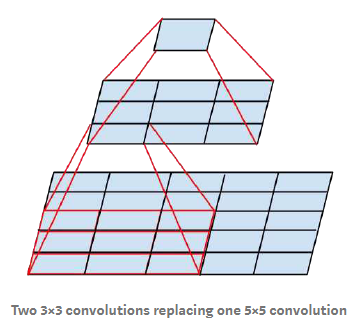                                               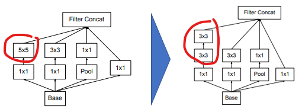

Next approach is Factorization into Asymmetric Convolutions: One 3×1 convolution followed by one 1×3 convolution replaces one 3×3 convolution as follows. The reduction in paramaters is 33%........leading to this type of module architecture (applicable to n x n convolutions):

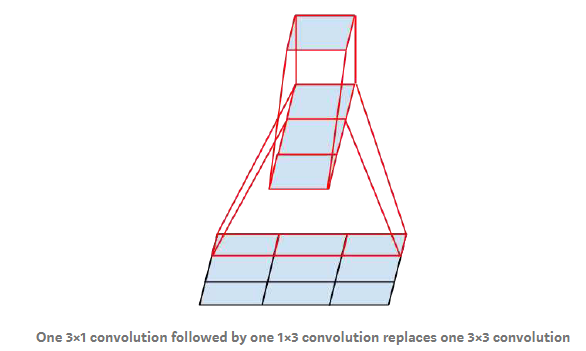                                               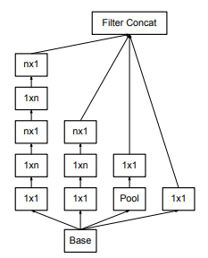

- Regularization: Inception V3 uses an auxiliary classifier on the top of the last 17×17 layer. This acts as a regularizer. An auxiliary classifier is a small CNN inserted between layers and the loss incurred during training is added to the main network loss (by penalizing the loss reduction objective, the auxilliary acts as regulizer). The loss is added with a weight of 0.4: `total_loss = main_loss + 0.4 * auxilliary_loss`.
The original motivation was to push useful gradients to the lower layers to make them immediately useful and improve the convergence during training by combating the vanishing gradient problem in very deep networks.

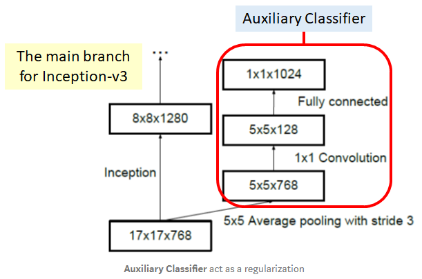

- Dimension reduction: Conventionally the feature map downsizing is done by max pooling. Inception V3 achieves the same ouput differently so that to reduce computational resources. Here, 320 feature maps are obtained using convolution with stride 2 while another 320 feature maps are obtained by max pooling. These 2 sets of 320 feature maps are then concatenated to output 640 feature maps.

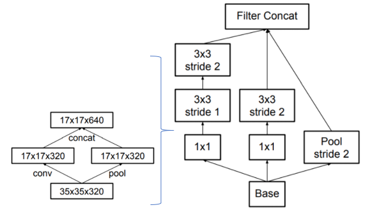

Overall, Inception V3 model has 24 million parameters, which is only 17% of VGG. This is nearly 6x less parameters !

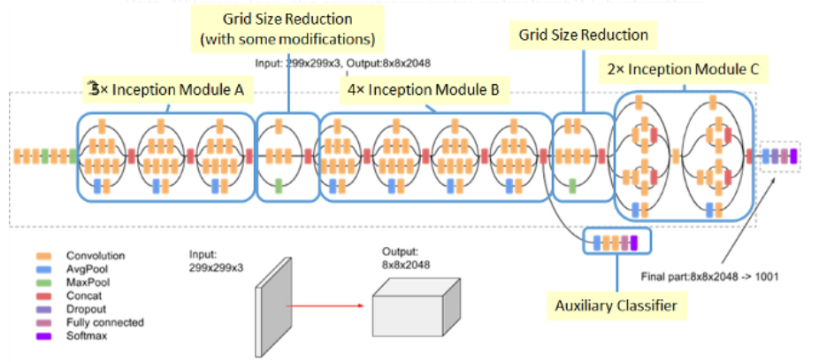

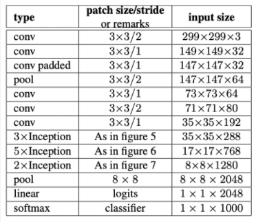

- Training:
I started off with a pretrained version of Inception V3 allowing all layers to be fined-tuned while training the new classifier end. After 15 epochs (Adam optimizer, lr of 10-4, batch of 32 images 299x299) the network achieved 86% overall accuracy on the test set (unseen images) with good performance accross the three classes (see accuracies below). Accuracy on Melanoma detection alone reached 95%! Additional training could certainly allow to improve even further.

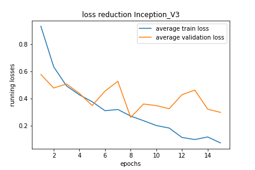          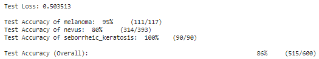 

Note that the race to develop higher performing models continues and newer models emerged since those discussed above. For example DenseNet uses the idea to reference feature maps from earlier in the network, in a similar but different approach to ResNet. Each layer's feature map is concatenated to the input of every successive layer within a dense block. This allows later layers within the network to directly leverage the features from earlier layers, encouraging feature reuse within the network. This re-use also allows to rely on small output channel depth of 12 filters only vastly reducing complexity! This network architecture was reported to outperfom ResNet at a much cheaper cost. And this goes on and on....

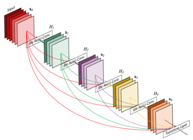  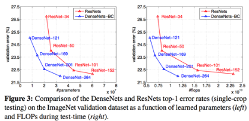

## Getting the Results
Once the model is trained, the notebook creates a CSV file to store test predictions. The file has exactly 600 rows, each corresponding to a different test image, plus a header row. You can find an example submission file (`sample_submission.csv`) in the repository.

The file has exactly 3 columns:
- `Id` - the file names of the test images (in the same order as the sample submission file)
- `task_1` - the model's predicted probability that the image (at the path in Id) depicts melanoma
- `task_2` - the model's predicted probability that the image (at the path in Id) depicts seborrheic keratosis

Once the CSV file is obtained, the notebook provides the scores for task_1, task_2 and the average of both. It also provides the corresponding ROC curves, along with the confusion matrix corresponding to melanoma classification.

## Results

I achieved my best results with ResNet50 and Inception V3. Key parameters:
- Adam optimizer, lr of 10-4 to 10-5
- Batch of 10 images 224 x 224 (ResNet), 32 images 299 x 299 (Inception)
- Torch CrossEntropyLoss
- 15 epochs (Inception) to 35 epochs in total (ResNet). ResNet has 7% more parameters than Inception (25.6Mio vs 23.9Mio) which cannot explain the quicker convergence. However training Inception proved to be significantly much longer on Google Colab vs my own GPU I used for ResNet.

- ROC curve achieved with Inception V3
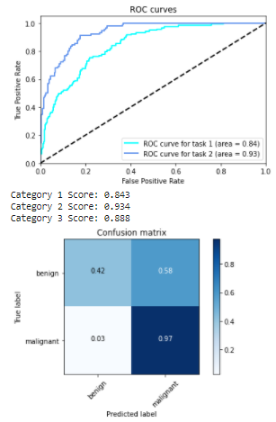

For explainations on ROC curve (Receiver Operating Characteristic) also called AUC (Area Under the Curve), you can see this [video](https://www.youtube.com/watch?v=OAl6eAyP-yo). In a nutshell a good classifier, ie separating well the two classes in a binary classification like task 1 and task 2 questions above, will get a high AUC (close to 1). A poor classifier would get close to the diagonal line with an AUC value towards 0.5 (random guessing).

In our case, good performance achieved with task 2.

The performance achieved on task 1 (predicting melanoma or not) can be further improved. Ideally we want a 'True positive rate' (ratio between case detected positive when actually positive over all actual positive) close to 1 (we do not want to miss a melanoma when there is one since this is deadly). Meanwhile we want a 'False positive rate' as low as possible (so that not to spend unnecessary investigations on healthy people). False Positive Rate is the ratio between healthy samples misclassified as positive over all heathy samples. Task 1 curve is not yet satisfying and should be like Task 2's profile. We want to be able to select a point on the curve in the upper left corner so that to have the highest True Positive Rate (TPR like 0.999) with the lowest possible False Positive Rate (FPR). In our situation, in order to secure the highest TPR (our priority), the best FPR we could expect is around 0.6 which means over 60% of the healthy people would be detected positive and sent to examination unnecessarily.
