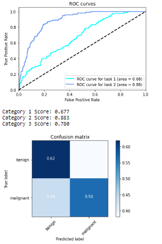

# Skin-Cancer-Classifier
Use CNN model to visually diagnose between 3 types of skin lesions using dermoscopic images.

This "Dermatologist-ai" project is part of the [Deep Learning Nanodegree with Udacity](https://www.udacity.com/course/deep-learning-nanodegree--nd101). The skin cancer classification model was trained and tested using both own GPU and google colab.

## Description
This project can visually diagnose between 3 types of skin lesions: melanoma, the deadliest form of skin cancer, and two types of benign lesions, nevi and seborrheic keratoses.

The data and objective are pulled from the [2017 ISIC Challenge on Skin Lesion Analysis Towards Melanoma Detection](https://challenge.kitware.com/#challenge/583f126bcad3a51cc66c8d9a). As part of the challenge, participants were tasked to design an algorithm to diagnose skin lesion images as one of three different skin diseases (melanoma, nevus, or seborrheic keratosis).

## Content
- Mount Google Drive
- Select folder with notebook and data folder in google colab
- Download the datasets and unzip into data folder
- import librairies and count available samples
- explore the data
- calculate corrective weights to compensate for skewness
- Set Dataloader
- Define train, validate and test functions
- Train the models
    - Obtain pre-trained VGG16 and adjust classifier section
    - specify loss function and optimizer
    - train and test the model
   - Repeat with Inception V3 and ResNet-152
 - Get predictions and prepare results file
 - Evaluate predictions and plot scores, ROC and confusion matrix

## Getting started
1.	Clone the repository and create a `data/` folder to hold the dataset of skin images.
2.	Create folders to hold the training, validation, and test images.
3.	Download and unzip the [training data](https://s3-us-west-1.amazonaws.com/udacity-dlnfd/datasets/skin-cancer/train.zip) (5.3 GB).
4.	Download and unzip the [validation data](https://s3-us-west-1.amazonaws.com/udacity-dlnfd/datasets/skin-cancer/valid.zip) (824.5 MB).
5.	Download and unzip the [test data](https://s3-us-west-1.amazonaws.com/udacity-dlnfd/datasets/skin-cancer/test.zip) (5.1 GB).
6.	Place the training, validation, and test images in the ` data/` folder, at `data/train/`, `data/valid/`, and `data/test/`, respectively. Each folder should contain three sub-folders (`melanoma/`, `nevus/`, `seborrheic_keratosis/`), each containing representative images from one of the three image classes.

## Approach
I started off with 3 pre-trained models (VGG16, Inception-V3, ResNet152) to benefit from transfer learning. These models have been already heavily trained for classification tasks using ImageNet database. ImageNet is a dataset of over 15 millions labeled high-resolution images with around 22,000 categories. To train these models, ILSVRC uses a subset of ImageNet of around 1000 images in each of 1000 categories. In all, there are roughly 1.2 million training images, 50,000 validation images and 100,000 testing images.

I adjusted the classification end of these networks to the task at hand (classification between 3 labels only).  I used the training and validation data to train a model that can distinguish between the three different image classes, saving the best parameters based on the reduction of the loss on the validation data.
Then, the test images are used to gauge the performance of the model on previously unseen images.

## Dataset
The proposed training, validation and test sets contain 2000, 160, 600 high-res RGB images respectively. The distribution between classes in the train set is heterogeneous. Nevus is highly over-represented (4x to 5x more images than the other two classes). I therefore used [ISIC database](https://www.isic-archive.com/#!/topWithHeader/onlyHeaderTop/gallery?filter=%5B%5D) to augment the number of under represented classes. I added about 1,160 new training images which i could find for Melanoma and seborrheic keratosis. To compensate for under-representation of seborrheic keratosis, I increased the number of images by applying horizontal and vertical flip, allowing to triple the amount in this class. Finally I removed all training images polluted by yellow / black markers, rulers (visual references added when taking the picture), pen annotations (circles around or arrows pointing to the lesion) which were visible on the image. The training dataset had the following final composition:

It is also possible to compensate class imbalance in the training set by calculating weights to provide to the loss function during training. I did not use this option in the final runs.

During training, I used various augmentation techniques for the training set to expand beyond the circa 3,200 images now available. In addition, available images came with multiple resolutions (for example (2592, 1936, 3)). The pre-trained models must have input images with minimum resolution of 299x299 (for Inception) or 224x224 (other models). In order to preserve details as much as possible (downsampling of images is at the expense of pixels), I determined the smallest dimensions available in the dataset, ie 450 x 576, and decided to resize images to that maximum possible uniform size. This obviously increase memory and computation requierements and necessitate to reduce the batch_size to avoid memory crash.

## Model architecture
VGG model did not deliver the best performance (below 55% accuracy after 10 epochs). Note that random guess over the 3 classes is 33%. Inception V3 reached 64% overall accuracy after 10 epochs. So I focused on this model.

Recap on Inception V3 architecture (inspired from this [paper](https://medium.com/@sh.tsang/review-inception-v3-1st-runner-up-image-classification-in-ilsvrc-2015-17915421f77c)).
Inception V3 is an improvement over previous versions of this architecture. The V3 objective was to reduce the number of parameters so that the model is less computational intensive, less prone to overfitting and allows to go really deep. This was proposed in the following [paper](https://arxiv.org/abs/1512.00567) published by V3's creators at Google in 2015.
The network as 42 layers overall. The reduction in parameters is achieved using various techniques. The techniques include factorized convolutions, regularization, dimension reduction, and parallelized computations.
-	Factorization: The aim of factorizing convolutions is to reduce the number of connections/parameters without decreasing the network efficiency. Factorization is performed by switching large kernel-size convolutions to smaller ones: convolutions involving large kernel size (5x5 or 7x7) are replaced by successive smaller size convolutions. Ex: 5x5 -> two 3x3. This allows to reduce the number of parameters from 5 x 5 = 25 to 3 x 3 + 3 x 3 = 18 which is nearly 30% less. Consequently, Inception's Module A is replaced using convolution factorization.

                                                  

Next approach is Factorization into Asymmetric Convolutions: One 3×1 convolution followed by one 1×3 convolution replaces one 3×3 convolution as follows. The reduction in paramaters is 33%........leading to this type of module architecture (applicable to n x n convolutions):

                                                    

- Regularization: Inception V3 uses an auxiliary classifier on the top of the last 17×17 layer. This acts as a regularizer. An auxiliary classifier is a small CNN inserted between layers and the loss incurred during training is added to the main network loss (by penalizing the loss reduction objective, the auxilliary acts as regulizer). The loss is added with a weight of 0.4: `total_loss = main_loss + 0.4 * auxilliary_loss`.
The original motivation was to push useful gradients to the lower layers to make them immediately useful and improve the convergence during training by combating the vanishing gradient problem in very deep networks.

- Dimension reduction: Conventionally the feature map downsizing is done by max pooling. Inception V3 achieves the same ouput differently so that to reduce computational resources. Here, 320 feature maps are obtained using convolution with stride 2 while another 320 feature maps are obtained by max pooling. These 2 sets of 320 feature maps are then concatenated to output 640 feature maps.

Overall, Inception V3 model has 24 million parameters, which is only 17% of VGG. This is nearly 6x less parameters !

## Getting the Results
Once the model is trained, the notebook creates a CSV file to store test predictions. The file has exactly 600 rows, each corresponding to a different test image, plus a header row. You can find an example submission file (`sample_submission.csv`) in the repository.

The file has exactly 3 columns:
- `Id` - the file names of the test images (in the same order as the sample submission file)
- `task_1` - the model's predicted probability that the image (at the path in Id) depicts melanoma
- `task_2` - the model's predicted probability that the image (at the path in Id) depicts seborrheic keratosis

Once the CSV file is obtained, the notebook provides the scores for task_1, task_2 and the average of both. It also provides the corresponding ROC curves, along with the confusion matrix corresponding to melanoma classification.

## Results

